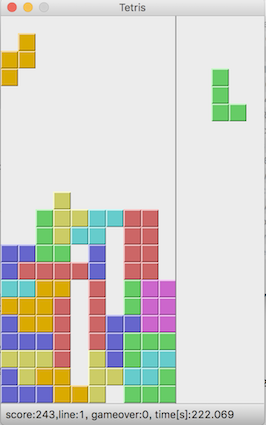

# 自己紹介

---

## テトリス評価サービスとは

技術チャレンジ部「tetris で python を学ぼう」
作成コードを本番環境で試行できる

---

### 現行システム問題

1. サーバが落ちるとサービス提供できなくなる（高田さん起きて！）
2. 落ちても運営側がすぐに気づけない
3. リクエストが増えるとさばけなくなる（そんな日が来てほしい）

---

# クラウドサービス化構想

問題の解決

＋クラウドサービス作ってみたい欲

＋高田さんを救いたい思い

## →AWS でテトリス評価サービス作る？？？

イメージは atcoder のテトリス版？

---

# クラウドシステム設計どうすればいいかわからなすぎ問題

1. 要件定義せねば
2. AWS のサービス多すぎ、選択肢多すぎ
3. システム構成考えたところでそれでいいのか分からなすぎ

---

## 要件定義

---

### AWS のお勉強 ひたすら AWS ブラックベルト

---

# システム構成のレビュー

やさしい大学時代の友人に感謝...

---

# 完成したシステム構成図

---

## いざ実装

- リソース定義は terraform
- バックエンドは python Django で（tetris で python を学ぼうだし、、）
  →https://github.com/seigot/tetris_score_server
- フロントエンドは flutter（クロスプラットフォームで強そう、スマホアプリも作ってみたいかも、、、）
  →https://github.com/seigot/tetris_score_server_frontend
- DB はコスパを考えて dynamodb
- 評価実行は ECS

---

## 開発の日々

---

## 評価フォームページ

---

## 評価結果ページ

---

# 最後に

もうちょいでリリース出来そうです
おたのしみに。。。。
